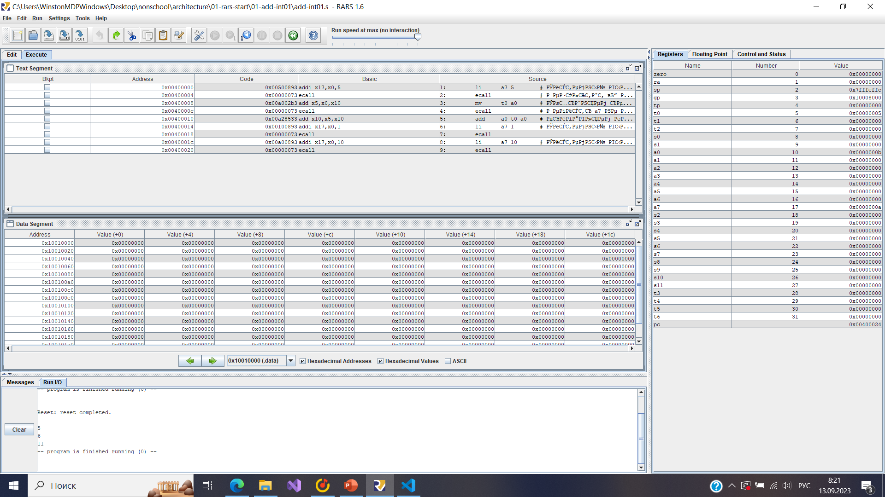
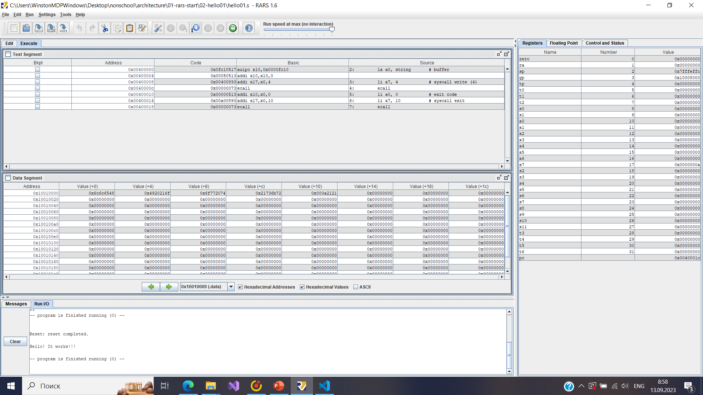
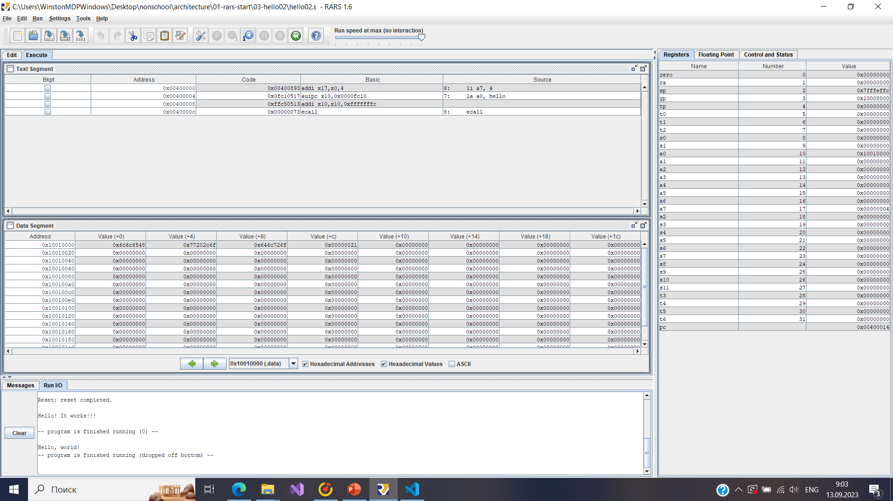
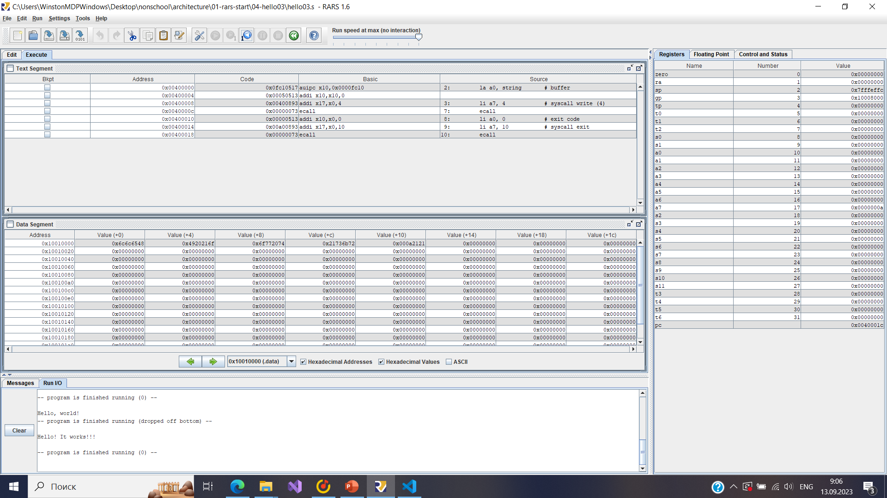
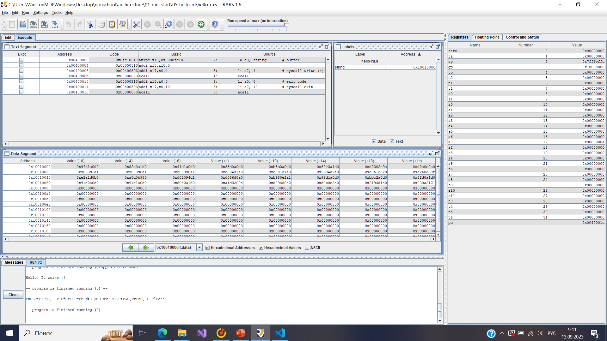
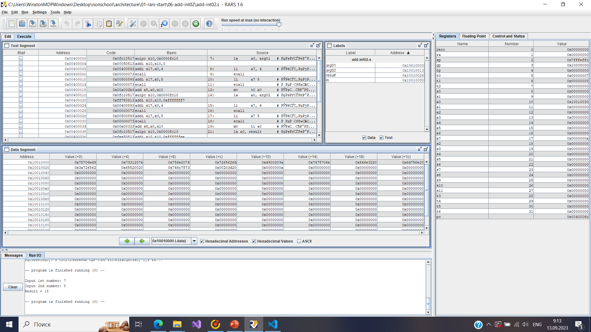

# Первая домашняя работа

## Запускаю каждую из предоставленных программ

## Псевдокоманды

Проанализировав программу hello01.s, сделал вывод, что комманды li, la
являются псевдокомандами.

## Типы команд

Программа hello01.s:

auipc - U

addi - I

## Системные вызовы в изученных прграммах

1 - напичатать int

4 - напечатать null-оканчивающуюся строку

5 - читать int с входа консоли

10 - выйти из программы с кодом 0
