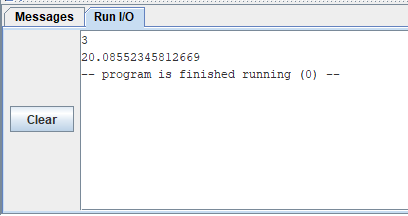
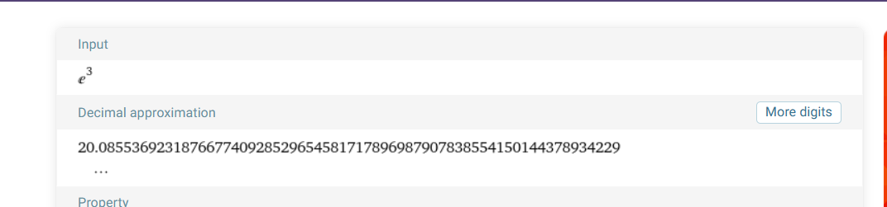
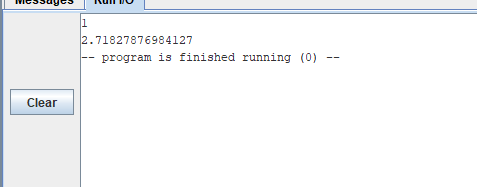
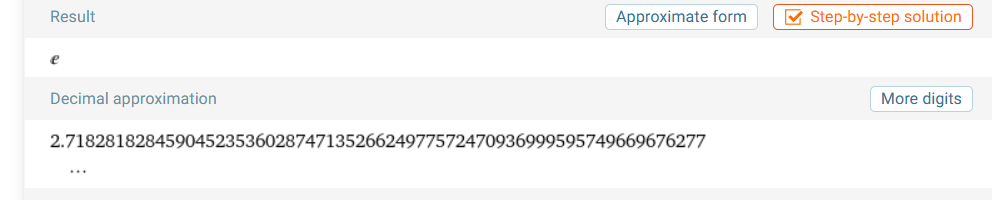
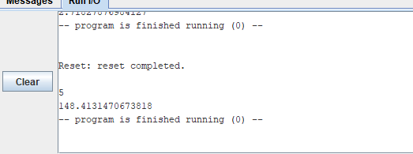
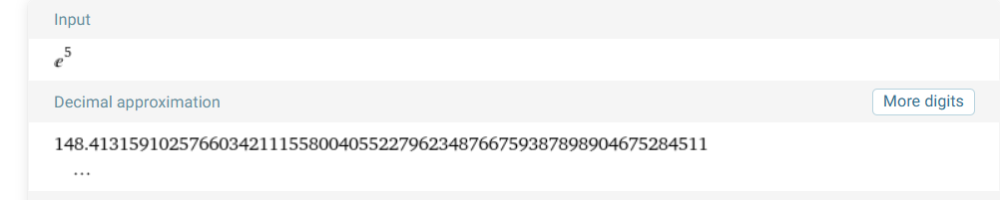
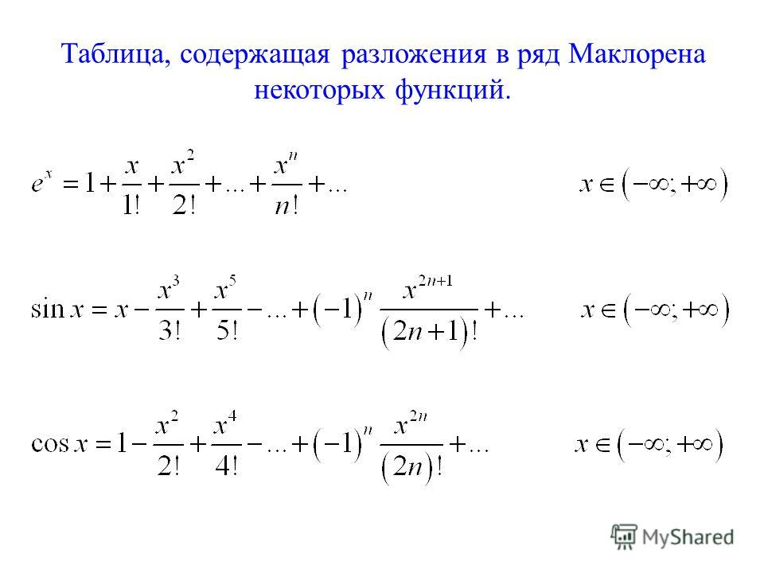

# ИДЗ 2, Исаев Роман Владимирович БПИ226, Вариант 13

Условие, специфичное для моего варианта: "Разработать программу,
вычисляющую с помощью степенного ряда с точностью не хуже 0,1%
значение функции e^x для заданного параметра x."

## Задание выполнено на 7 баллов

1. Выполнены требования на 4-5 баллов.
    1. Написал программу на языке ассемблера, удовлетворяющую условиям
    задачи.
    2. Добавил поясняющие комментарии.
    3. Добавил в репозиторий результаты тестов в виде
    картинок.
    4. Использовал только double.
2. Выполнены требования на 6-7 баллов.
    1. Разделил программу на подпрограммы, которым передаются параметры.
    2. Добавил комментарии, описывающие принимаемые и
    возвращаемые подпрограммами значения.

## Тесты

## Метод решения задачи

Вычислял очередной элемент ряда и складывал с суммой всех
вычисленных членов, пока разница между текущей и
предыдущей суммой не будет меньше 0.0001.

## Задание выполнено с помощью данного источника информации

